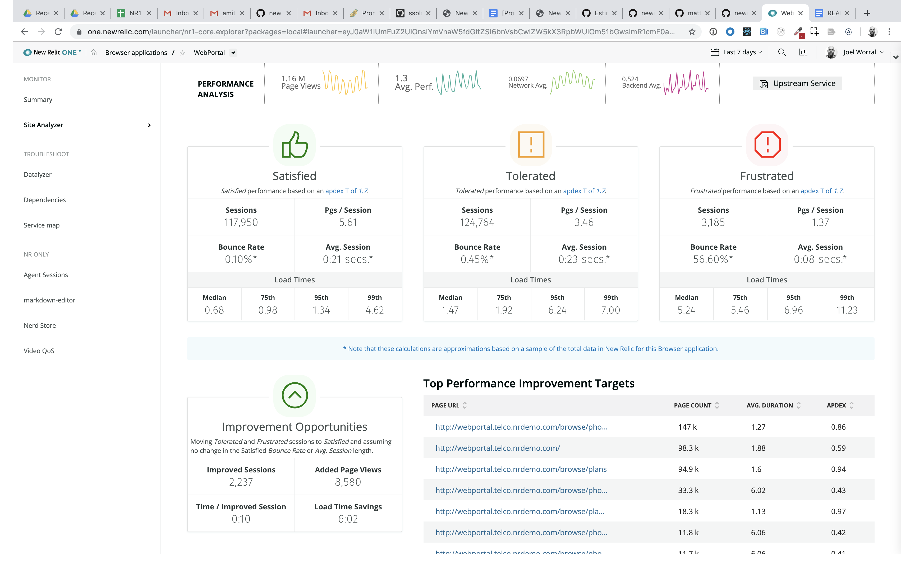

# nr1-browser-analyzer

  [](https://snyk.io/test/github/newrelic/nr1-browser-analyzer)

## Usage

nr1-browser-analyzer uses the `PageView` events in New Relic to interrogate and categorize the performance of a web site. You can explore the performance of individual pages, and forecast how improving performance impacts KPIs like bounce rate and traffic. This analysis is based on moving individual browsing sessions from `Tolerated` and `Frustrated` into `Satisfied` (as defined by the [`apdex`](https://docs.newrelic.com/docs/apm/new-relic-apm/apdex/apdex-measure-user-satisfaction) value for a given New Relic Browser application). 




## Open Source License

This project is distributed under the [Apache 2 license](LICENSE).

## What do you need to make this work?

1. [New Relic Browser agent(s) installed](https://newrelic.com/products/browser-monitoring) and the related access to [New Relic One](https://newrelic.com/platform).
2. See step 1. :grin:

## Getting started

Clone this repository and run the following scripts:

```bash
git clone https://github.com/newrelic/nr1-browser-analyzer.git
cd nr1-browser-analyzer
nr1 nerdpack:uuid -gf
npm install
npm start
```

Visit https://one.newrelic.com/?nerdpacks=local, navigate to the Nerdpack, and :sparkles:

# Support

New Relic has open-sourced this project. This project is provided AS-IS WITHOUT WARRANTY OR SUPPORT, although you can report issues and contribute to the project here on GitHub.

_Please do not report issues with this software to New Relic Global Technical Support._

## Community

New Relic hosts and moderates an online forum where customers can interact with New Relic employees as well as other customers to get help and share best practices. Like all official New Relic open source projects, there's a related Community topic in the New Relic Explorer's Hub. You can find this project's topic/threads here:

https://discuss.newrelic.com/c/build-on-new-relic/nr1-browser-analyzer
*(Note: URL subject to change before GA)*

## Issues / Enhancement Requests

Issues and enhancement requests can be submitted in the [Issues tab of this repository](../../issues). Please search for and review the existing open issues before submitting a new issue.

# Contributing

Contributions are welcome (and if you submit a Enhancement Request, expect to be invited to contribute it yourself :grin:). Please review our [Contributors Guide](CONTRIBUTING.md).

Keep in mind that when you submit your pull request, you'll need to sign the CLA via the click-through using CLA-Assistant. If you'd like to execute our corporate CLA, or if you have any questions, please drop us an email at opensource@newrelic.com.
