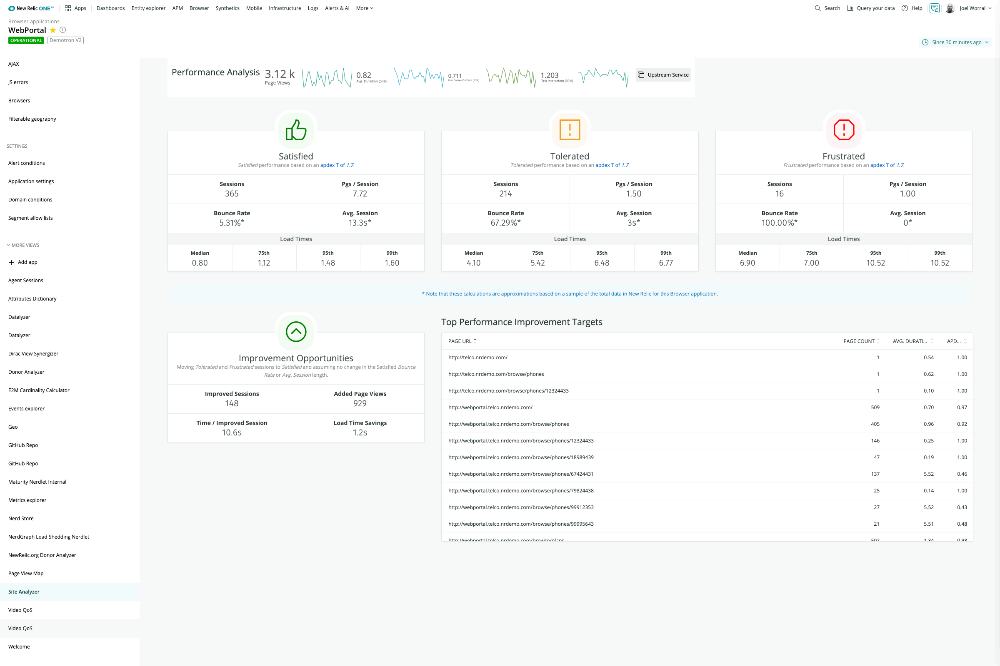

# New Relic Browser Analyzer

  

## Usage

Using the [`Apdex`](https://docs.newrelic.com/docs/apm/new-relic-apm/apdex/apdex-measure-user-satisfaction) score generated by [`Browser's`](https://newrelic.com/products/browser-monitoring) _PageView_ event, Browser Analyzer displays an analysis of performance, and forecasts how performance improvements can impact Key Performance Indicators, like bounce rate or traffic.

This application allows you to explore the performance of individual site pages, and identifies improvement opportunities by showing which pages have the worst performance impact, allowing you to target high-impact fixes.

## Dependencies

Requires [`New Relic Browser`](https://newrelic.com/products/browser-monitoring).

## Enabling this App

This App is available via the New Relic Catalog. 

To enable it in your account, go to `Add Data > Apps and Visualzations` and search for "Browser Analyzer". Click the card, and then click the "Add this App" button to add it to your account(s).

Once subscribed: 
1. navigate to a Browser app via the Entity Explorer in New Relic One
2. locate the "Site Analyzer" menu item in the secondary left-nav, found under "More Views"
3. click "Site Analyzer" to open the app (note: on the first time accessing the app, you may be prompted to enable it)

#### Manual Deployment
If you need to customize this application, you can fork the codebase and follow the instructions on how to [Customize a Nerdpack](https://developer.newrelic.com/build-apps/customize-nerdpack). If you have a change you feel everyone can benefit from, please submit a PR!

## Support

This project is actively maintained by the New Relic Labs team. Connect with us directly by [creating issues](../../issues) or [asking questions in the discussions section](../../discussions) of this repo.

We also encourage you to bring your experiences and questions to the [Explorers Hub](https://discuss.newrelic.com) where our community members collaborate on solutions and new ideas.

New Relic has open-sourced this project, which is provided AS-IS WITHOUT WARRANTY OR DEDICATED SUPPORT.

## Security

As noted in our [security policy](https://github.com/newrelic/nr1-browser-analyzer/security/policy), New Relic is committed to the privacy and security of our customers and their data. We believe that providing coordinated disclosure by security researchers and engaging with the security community are important means to achieve our security goals.
If you believe you have found a security vulnerability in this project or any of New Relic's products or websites, we welcome and greatly appreciate you reporting it to New Relic through [HackerOne](https://hackerone.com/newrelic).

## Contributing 

Contributions are welcome; please review our [Contributors Guide](CONTRIBUTING.md).

Keep in mind that when you submit a pull request, you'll need to sign the CLA via the click-through using CLA-Assistant. If you'd like to execute our corporate CLA, or if you have any questions, please drop us an email at opensource@newrelic.com.

## Open Source License

This project is distributed under the [Apache 2 license](LICENSE).
